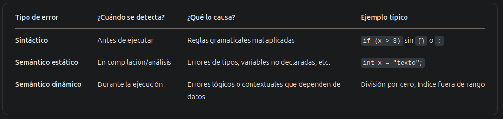

# Práctica Nro. 3 - Semántica

Objetivo: Interpretar el concepto de semántica de los lenguajes de programación.

### Ejercicio 1: ¿Qué define la semántica?

La semántica es el conjunto de reglas que permite definir el significado de los símbolos, palabras y frases de un lenguaje natural o informático. En este contexto, describe el significado de las sentencias y programas de un lenguaje de programación que es sintácticamente válido.

### Ejercicio 2:
**a. ¿Qué significa compilar un programa?**
**b. Describa brevemente cada uno de los pasos necesarios para compilar un programa.**
**c. ¿En qué paso interviene la semántica y cual es su importancia dentro de la compilación?**

**a.**
Compilar un programa implica realizar una traducción del código de un programa que se encuentra en un lenguaje de alto nivel, a un lenguaje de bajo nivel o máquina, con el fin de que una computadora sea capaz de procesar dicho programa. El programador escribe código en lenguajes de alto nivel, con mayor similitud al lenguaje natural, y luego el proceso de compilación realiza la traducción para que las sentencias sean entendidas por una computadora.

**b.**
La compilación de un programa consta de varios pasos. Se puede dividir en dos etapas:

> Etapa de análisis

- Análisis léxico (Scanner):
    - Analiza a nivel de palabra
    - Divide el programa en sus elementos/categorías
    - Analiza el tipo de cada elemento para ver si sus tokens son válidos
    - Filtra comentarios y separadores
    - Lleva una tabla para la especificación del analizador léxico, que incluye cada categoría, conjunto de atributos y acciones asociadas

- Análisis sintáctico (Parser):
    - Analiza a nivel de sentencia/estructura
    - Utiliza los tokens del analizador léxico
    - Usa técnicas de gramáticas formales
    - Las estructuras se pueden representar mediante el árbol de análisis sintáctico

- Análisis semántico (estático): 
    - Procesa las estructuras sintácticas
    - Realiza la comprobación de tipos
    - Realiza comprobaciones de duplicados, problemas de tipos, de nombres (todas las variables deben estar declaradas), etc.
    - Agrega a la tabla de símbolos los descriptores de tipos 

> Etapa de síntesis

- Construye el programa ejecutable y genera el código necesario
- Se realiza el proceso de optimización, que es optativo 
- Puede construirse el código completo directamente o crear una instancia de código intermedio (ensamblador)

**c.**
La semántica interviene  en el análisis semántico, el cual corresponde a la semántica estática. Es de gran importancia porque toma lo producido por los anteriores análisis y realiza comprobaciones de significado con las estructuras sintácticas, tal como las comprobaciones de tipos (y sus posibles problemas), duplicados, que todas las variables estén declaradas, etc.
Realizar este análisis en compilación permite detectar errores de forma temprana, antes de ejecutar el programa. 

### Ejercicio 3: Con respecto al punto anterior ¿es lo mismo compilar un programa que interpretarlo?
**Justifique su respuesta mostrando las diferencias básicas, ventajas y desventajas de cada uno.**

No, no es lo mismo.
La compilación, como se explicó, consiste en la traducción de un código en alto nivel a uno en lenguaje máquina.
La interpretación consiste en la lectura, análisis, decodificación y ejecución de cada sentencia de un programa en tiempo de ejecución. El interpretador realiza esta secuencia de pasos con cada línea del programa, mientras se ejecuta. Por cada acción posible existe un subprograma, que ejecuta dicha acción. La interpretación se realiza llamando a estos subprogramas en una determinada secuencia.

> Por cómo se ejecuta

- Intérprete
    - Se utiliza en la ejecución.
    - Ejecuta el programa línea por línea.
    - Por donde pase dependerá de la acción del usuario, de la entrada de datos y/o de alguna decisión del programa.
- Compilador
    - Se utiliza antes de la ejecución.
    - Produce un programa ejecutable equivalente en lenguaje objeto.
    - Pasa por todas las líneas

> Por el orden de ejecución

- Intérprete
    - Sigue el orden lógico de ejecución (no necesariamente recorre todo el código).
- Compilador
    - Sigue el orden físico de las sentencias (recorre todo).

> Por el tiempo consumido de ejecución

- Intérprete
    - Por cada sentencia que pasa realiza el proceso de decodificación (lee, analiza y ejecuta), es decir, es repetitivo.
    - Si la sentencia está en un proceso iterativo (ej.: for/while), se realizará la tarea de decodificación tantas veces como sea requerido.
    - La velocidad de proceso se puede ver afectada.
- Compilador
    - Pasa por todas las sentencias.
    - No repite lazos.
    - Traduce todo de una sola vez.
    - Genera código objeto ya compilado.
    - La velocidad de compilar dependerá del tamaño del código.

> Por la eficiencia posterior

- Intérprete
    - Más lento en ejecución.
- Compilador
    - Es más rápido ejecutar desde el punto de vista del hardware porque ya está en un lenguaje de más bajo nivel.
    - Detecta más errores al pasar por todas las sentencias.
    - Tarda más en compilar porque se verifica todo previamente.

> Por el espacio ocupado

- Intérprete
    - Al no pasar por todas las sentencias, ocupa menos en la memoria.
    - Las Tablas de símbolos, variables y otros se generan cuando se usan en forma dinámica.
- Compilador
    - Al pasar por todas las sentencias, ocupa más espacio en la memoria.
    - Una sentencia puede ocupar decenas o centenas de sentencias de máquina al pasar a código objeto.
    - Cosas cómo tablas de símbolos, variables, etc. se generan siempre se usen o no.
    - En general, termina ocupando más espacio.

> Por la detección de errores

- Intérprete
    - Las sentencias del código fuente pueden ser relacionadas directamente con la sentencia en ejecución entonces se puede ubicar donde se produjo el error.
    - Es más fácil detectarlos y corregirlos por donde pasa la ejecución.
- Compilador
    - Es casi imposible ubicar el error (en ejecución), pobres en significado para el programador.
    - Se deben usar otras técnicas (ej. Semántica Dinámica).

### Ejercicio 4: Explique claramente la diferencia entre un error sintáctico y uno semántico. Ejemplifique cada caso.

- Error sintáctico:

Ocurre cuando el código no sigue las reglas gramaticales del lenguaje de programación acerca de la correcta composición de letras, dígitos y caracteres. Estos errores son identificados durante el análisis sintáctico (parser).
Ej. en C:

```c
    int main() {
        int a = 5
    }
```

Este error es sintáctico ya que no se respeta la estructura definida para la declaración e inicialización de una variable, pues falta el ";" al final de la expresión.

- Error semántico:

Refiere al caso en que un código respeta la estructura del código, es decir, su sintaxis es correcta, pero no produce los resultados esperados debido a una incorrecta interpretación del signficado del código. Pueden producirse comportamientos inesperados o resultados incorrectos durante la ejecución del programa.
Ej en C:

```c
    int main() {
        int a = 5;
        char b = 'b';
        int c = a/b;
    }
```

La operación `a/b` produce un error semántico ya que `a` es un entero y `b` es un caracter. Durante la comprobación de tipos, se determinará que la operación no se puede realizar y producirá un error de tipo semántico.



nota:
También existen los errores lógicos, que ocurren cuando el programa se ejecuta correctamente (sin errores sintácticos o semánticos), pero no hace lo que el programador pretendía.
El código es válido y puede ejecutarse sin problemas, por lo que el compilador o intérprete no lo detectan. El error está en la lógica del algoritmo o en la interpretación del problema, no en la gramática. (Ejemplo: método que debe calcular área y calcula perímetro, o loop infinito). A diferencia de un error semántico dinámico, no se lanza una excepción ni se detiene la ejecución del código (al menos por un error) ante un error lógico.


### Ejercicio 5: Sean los siguientes ejemplos de programas. Analice y diga qué tipo de error se produce (Semántico o Sintáctico) y en qué momento se detectan dichos errores (Compilación o Ejecución).
**Aclaración: Los valores de la ayuda pueden ser mayores.**

Se entiende que un error sintáctico se detecta en compilación.

**a. Pascal**

```pascal
Program P   // Error sintáctico, falta un ";"
    var 5: integer; // Error sintáctico, el nombre de un identificador no puede comenzar con un dígito numérico
    var a: char;
Begin
    for i:=5 to 10 do begin // Error semántico en compilación, i no fue declarada
        write(a);   // a no inicializado es un warning, no un error
        a=a+1;  { 
                    Error semántico en compilación, se intenta sumar un entero a un char 
                    Error sintáctico, las asignaciones se realizan con ":="
                } 
    end;
End.
```

Ayuda: Sintáctico 2, Semántico 3

**b. Java**

```java
    public String tabla(int numero, arrayList<Boolean> listado) {   // Error sintáctico, arrayList debe ser ArrayList
        String result = null;
        
        for(i = 1; i < 11; i--) {   /* Error lógico, loop infinito 
                                       Error semántico en compilación, variable i no declarada 
                                    */ 
            result += numero + "x" + i + "=" + (i*numero) + "\n";   /* Podría considerarse error lógico si no se quería 
                                                                       que se concatene la palabra null
                                                                    */
            
            listado.get(listado.size()-1)=(BOOLEAN) numero>i;   /* Error sintáctico. Wrapper de bool es Boolean
                                                                   Error sintáctico, la gramática indica que en el lado izquierdo de una asignación debe ir una variable
                                                                */
        }
        
        return true;    // Error semántico en compilación, debe retornar String
    }
```

Ayuda:
Sintácticos 4, Semánticos 3, Lógico 1

**c. C**

```c
# include <stdio.h>
int suma; /* Esta es una variable global */ // Variables globales (estáticas) son inicializadas por defecto
int main() { 
    int indice;
    encabezado; // Error semántico en compilación, no fue indicado un tipo
    
    for (indice = 1 ; indice <= 7 ; indice ++)  // Error sintáctico, cuerpo de sentencia for debe ir entre "{}"
    
    cuadrado (indice);  // Error semántico en compilación. Función no ha sido declarada antes de su invocación

    final();  Llama a la función final */ /* Error semántico en compilación, función final() no fue declarada
                                             Error sintáctico, falta apertura del comentario
                                        */

    return 0;
}

cuadrado (numero)   // Error sintáctico, falta tipo de retorno
int numero;
{
    int numero_cuadrado;
    numero_cuadrado == numero * numero; // Error sintáctico, la asignación utiliza símbolo "="
    suma += numero_cuadrado;
    printf("El cuadrado de %d es %d\n",
    numero, numero_cuadrado);
}
```

Ayuda: Sintácticos 2, Semánticos 6

**d. Python**

Python es un lenguaje interpretado, no hay errores semánticos estáticos. Realiza una compilación pero analiza sintaxis, no hace chequeo de tipos

```python
#!/usr/bin/python
print "\nDEFINICION DE NUMEROS PRIMOS"  # Error sintáctico. "print(...)" es correcto
r = 1
while r = True: # Error sintáctico. Operador de comparación es "==" 
    
    N = input("\nDame el numero a analizar: ")  # Podría considerarse un error lógico, ya que debería castearse a entero
    i = 3
    fact = 0
    if (N mod 2 == 0) and (N != 2): # Error semántico en ejecución. Se intenta aplicar una operación numérica a string
                                    # Error sintáctico. Se debe usar "%" para el módulo

        print "\nEl numero %d NO es primo\n" % N    # Error sintáctico. "print(...)" es correcto
    else:
        while i <= (N^0.5): # Error semántico en ejecución. Se intenta utilizar operación numérica a string
            
            if (N % i) == 0:    # Error semántico en ejecución. Operación numérica a string
                
                mensaje="\nEl numero ingresado NO es primo\n" % N   # Error semántico en ejecución. Se intenta imprimir
                                                                    # pero no hay variable para formatear a string
                
                msg = mensaje[4:6]
                
                print msg   # Error sintáctico. Faltan "()"
                
                fact = 1
            i+=2
        if fact == 0:
            
            print "\nEl numero %d SI es primo\n" % N    # Error sintáctico. Faltan "()"

    r = input("Consultar otro número? SI (1) o NO (0)--->> ")
```

Ayuda: Sintácticos 2, Semánticos 3

**e. Ruby**

Es lenguaje interpretado. No hay errores en compilación

```ruby
def ej1
    Puts 'Hola, ¿Cuál es tu nombre?'    # Error sintáctico. Es "puts"
    nom = gets.chomp
    puts 'Mi nombre es ', + nom # Error sintáctico. Se utiliza "+", por lo que la "," sobra

    puts 'Mi sobrenombre es 'Juan'' # Error sintáctico. Hay comillas en "Juan", dentro de las comillas de la cadena
    puts 'Tengo 10 años'
    meses = edad*12 # Error semántico en ejecución. Variable edad no fue declarada
    
    dias = 'meses' *30  # Error semántico en ejecución. Se intenta multiplicar un string
    
    hs= 'dias * 24' # Error lógico. No se efectúa la operación, se guarda como cadena
    
    puts 'Eso es: meses + ' meses o ' + dias + ' días o ' + hs + ' horas' # Error sintáctico. No se cierran comillas
                                                                          # Error semántico en ejecución. Incorrecta concatenación
    puts 'vos cuántos años tenés'
    edad2 = gets.chomp
    edad = edad + edad2.to_i    # Error semántico. Variable edad no está declarada
    puts 'entre ambos tenemos ' + edad + ' años'
    puts '¿Sabes que hay ' + name.length.to_s + ' caracteres en tu nombre, ' + name + '?'   # Error semántico. name no está declarada
end
```

Ayuda: Semánticos +4

### Ejercicio 5 (de vuelta?): Dado el siguiente código escrito en pascal. Transcriba la misma funcionalidad de acuerdo al lenguaje que haya cursado en años anteriores. Defina brevemente la sintaxis (sin hacer la gramática) y semántica para la utilización de arreglos y estructuras de control del ejemplo.

```pascal
Procedure ordenar_arreglo(var arreglo: arreglo_de_caracteres;cont:integer);
var
    i:integer; ordenado:boolean;
    aux:char;
begin
    repeat
        ordenado:=true;
        for i:=1 to cont-1 do begin
            if ord(arreglo[i])>ord(arreglo[i+1]) then begin
                aux:=arreglo[i];
                arreglo[i]:=arreglo[i+1];
                arreglo[i+1]:=aux; ordenado:=false
            end;
        end;
    until ordenado;
end;
```

Observación: Aquí sólo se debe definir la instrucción y qué es lo que hace cada una; detallando alguna particularidad del lenguaje respecto de ella. Por ejemplo el for de java necesita definir una variable entera, una condición y un incremento para dicha variable.

```java
    public void ordenar_arreglo(ArrayList<char> arreglo, int cont) {
        boolean ordenado;
        char aux;
        
        do {
            ordenado = true;
            for(int i = 1; i < cont; i++) {
                if(arreglo.get(i) > arreglo.get(i+1)) {
                    aux = arreglo.get(i);
                    arreglo.set(i, arreglo.get(i+1));
                    arreglo.set(i+1, aux);
                    ordenado = false;
                }
            }    
        } while(ordenado)
    }
```

En java debe indicarse la visibilidad del método. Se optó por utilizar un ArrayList en vez de un arreglo.
`repeat ... until(condicion)` se reemplaza por `do ... while(condicion)`.
El índice del arreglo puede declararse e inicializarse en la propia declaración del bucle for.
A diferencia de Pascal, que se debe utilizar la función ord, en Java se puede comparar directamente el valor ASCII de los caracteres. Luego, para acceder y actualizar el ArrayList se deben utilizar métodos propios de este.

### Ejercicio 6: Explique cuál es la semántica para las variables predefinidas en lenguaje Ruby self y nil. ¿Qué valor toman; cómo son usadas por el lenguaje?

> self

Es una variable predefinida que hace referencia al objeto receptor del mensaje (sobre el que se ejecuta el método).
Equivale a `this` en Java.
Su valor varía según el contexto de ejecución:
- Dentro de una clase, `self` es la misma clase
- Dentro de una instancia, `self` es el objeto instanciado

> nil

Representa la ausencia de un valor (null en otros lenguajes).
Es una instancia de la clase `NilClass`. En booleanos su valor es equivalente a false.
Es el valor predeterminado para variables no inicializadas y métodos que explícitamente no retornan nada.

### Ejercicio 7: Determine la semántica de null y undefined para valores en javascript.¿Qué diferencia hay entre ellos?

> null

Representa intencionalmente la ausencia de valor. Es un objeto especial y se suele asignar manualmente (para indicar que debería haber valor, pero no lo hay)

> undefined

Significa que una variable fue declarada pero no inicializada. También lo retornan funciones sin return específico.
El sistema lo asigna automáticamente cuando no hay valor definido.

Por lo tanto, `null` es un objeto mientras que `undefined` no. `null` se asigna manualmente y `undefined` automáticamente. La comparación entre ambos con el operador `==` (conversión de tipo) es verdadera mientras que con `===` (comparación estricta) es falsa.

### Ejercicio 8: Determine la semántica de la sentencia break en C, PHP, javascript y Ruby. Cite las características más importantes de esta sentencia para cada lenguaje

En todos los mencionalos lenguajes, `break` permite salir inmediatamente de una estructura de control iterativa y, opcionalmente, romper estructuras `switch case`.

> C

Permite salir de estructuras `for`, `while`, `do-while` y `switch`, pero no se puede usar para salir de múltiples bucles a la vez.

> PHP

Similar a C, pero admite un número para indicar la cantidad de niveles a romper de la estructura de control.

> JavaScript

Funciona en bucles y `switch`. Admite labels con estructuras anidadas. `break label` permitirá salir del bucle etiquetado

> Ruby

Rompe `while`, `until`, `for` y `each`. Además, permite devolver un valor del bloque

### Ejercicio 9: Defina el concepto de ligadura y su importancia respecto de la semántica de un programa. ¿Qué diferencias hay entre ligadura estática y dinámica? Cite ejemplos (proponer casos sencillos)

Una ligadura (binding) es la asociación entre un identificador (nombre de variable, función) y una propiedad o entidad semántica, tal como su tipo, valor, definición, implementación, dirección de memoria. 
No es únicamente entre una variable y su valor, sino que puede incluir su tipo, dirección, alcance, etc. Es la ligadura entre un elemento del lenguaje y sus atributos. 
Las ligaduras determinan que significa una referencia en el programa.
En cuanto a su importancia semántica, estas afectan directamente la validez y significado de las operaciones del programa. Los cambios en la forma en que se resuelven las ligaduras pueden alterar completamente la ejecución de un programa.
Existen dos tipos de ligaduras:

- Estática:

Se resuelve en tiempo de compilación. El alcance y significado de un nombre se resuelve mirando la estructura del código, sin necesidad de ejecutarlo

```c
int x = 1;

void foo() {
    int x = 2;
    printf("%d", x); // Imprime 2: la ligadura de "x" se hace con la variable local
}
```

Aquí el compilador sabe que `x` refiere a la variable local por su ubicación en el programa.

- Dinámica

Se resuelve en tiempo de ejecución.
Significa que el entorno dinámico afecta qué valor se asocia a un identificador.
Asociada a lenguajes antiguos o muy dinámicos.

```lisp
(define x 5)

(define (foo) x)

(define (bar)
  (let ((x 10))
    (foo))) ; Resultado depende del lenguaje

; Si el lenguaje usa ligadura dinámica, foo devuelve 10 (valor de x en bar).
; Si usa ligadura estática, foo devuelve 5 (valor global de x).
```

En cuanto a sus diferencias:

> Momento de la ligadura

La estática puede ligarse en la definición del lenguaje (forma de las sentencias), implementación (set de valores y operaciones) y/o compilación (asignación de tipo). La ligadura en compilación puede ser explícita, implícita o inferida.
La dinámica en ejecución (asignación de valor).

> Estabilidad

La estabilidad de una ligadura estática indica que este tipo de binding no puede ser modificado. En la ligadura dinámica si puede hacerse, exceptuando a las constantes.

> Alcance

La estática define su alcance en términos de la estructura léxica del programa. Se liga examinando el código, el alcance depende de la ubicación de la declaración de la variable en el código.
La dinámica define su alcance en términos de la ejecución del programa. Cada declaración extiende su efecto sobre las instrucciones ejecutadas posteriormente hasta una nueva declaración de la variable con el mismo nombre.