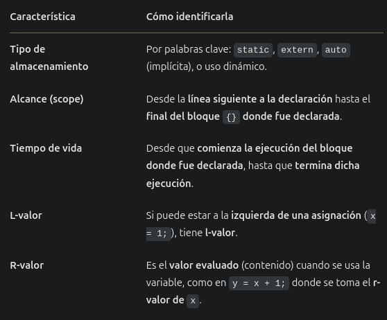

# Práctica Nro. 4 - Variables

Objetivo: Conocer el manejo de identificadores en memoria y como lo definen e implementan los
diferentes lenguajes.

Siendo tiempo de vida desde que se aloca hasta que se libera y alcance desde la declaración hasta el fin del bloque, para la resolución de este trabajo se tomó la siguiente convención:
El alcance en lenguajes como Pascal, con sección de declaración, se considera desde el Begin hasta End (declaración a fin de bloque). -> Podría estar mal, alcance desde la línea siguiente a su declaración hasta final del bloque?
El tiempo de vida se considera desde comienzo del bloque hasta final del mismo ("línea 1").

Definiciones:

> Tiempo de vida

Es el período durante el cual la variable existe en memoria. Inicia en el momento en que se reserva memoria (alocación) y termina cuando se libera.
Las variables pueden tener tiempo de vida automático (por bloque), estático (todo el programa) o dinámico (controlado por el programador).

> Alcance

Es el fragmento de código en el que se puede hacer referencia a una variable por su nombre. Existe el alcance estático (importa donde está escrita la variable) y alcance dinámico (importa quien llama a quien en tiempo de ejecución).
En lenguajes como Pascal, donde la declaración pertenece a una sección `var`, el alcance comienza desde el inicio del bloque.

> Tipo de almacenamiento


> Tiempo de vida vs. Alcance

- Alcance: cuándo puedo referirme por nombre a la variable en el código fuente. Visible desde la declaración hasta el final del bloque.
- Tiempo de vida: cuándo la variable realmente existe en memoria. Activo en memoria desde que comienza la ejecución del bloque donde está hasta que termina esa ejecución.
- Tener en cuenta que un bucle for, estructura if y demás estructuras de control son considerados bloques, por lo que una variable declarada allí tendrá un tiempo de vida y alcance limitado a este.





Tiempo de vida de un static es todo el programa (independientemente de si fue declarada dentro de un módulo o no). Su alcance es desde que es declarada hasta el final del bloque.
El extern se usa para extender el alcance de una variable a otro archivo. Para hacer uso de esta cláusula, la variable debe estar previamente definida y no puede ser interna (a una función por ejemplo), debe ser global.
Tener en cuenta que si aparece una variable con el mismo nombre en un bloque (ej: en una función), el alcance de la variable que está en el bloque más general es opacado lo que dura dicho bloque interno.

> Variables extern

En C, el modificador `extern` se utiliza para declarar una variable global que está definida en otro archivo fuente y otro lugar del mismo archivo. Es una variable global estática (almacenamiento estático, pero no es `static`, que limita visibilidad).
Su alcance se limita al archivo y bloque donde se declara. Si se declara fuera de una función, su alcance es todo el archivo desde esa declaración (una línea adelante). Si se lo hace dentro de una función, su alcance es ese bloque.
`extern` no crea una nueva variable, solo permite que se acceda a ella desde otro lado. Pero la alocación se da una única vez para la variable original. `extern` tampoco inicializa, pues toma el valor que la variable ya tenía.
- Debe llevar el mismo nombre que la variable original.
- Principalmente para extender a otros archivos (ya es global, es redudante usar `extend` en el mismo archivo).
- El tiempo de vida siempre refiere a la variable original, porque extend no crea una nueva variable (no aloca), solo utiliza la ya alocada. 
- Dado que no es una definición y no tiene tiempo de vida propio, lo único que puede cambiar con respecto a la original es su alcance
- Si la variable global es `static`, no puede declararse como `extern`.
- Su tiempo de vida es toda la ejecución del programa. Esto engloba todos los archivos donde sea utilizada (el de origen y los `extern`).

Aunque no use `extern`, si el programa consta de dos archivos y una variable tiene tiempo de vida de todo el programa, abarca ambos archivos.
Valor que apunta puntero (p^) tiene tipo de l-valor determinado por lo que apuntan. Si apuntan a variable estática o automática, serán de este tipo. Serán dinámicos si apunta a dirección de memoria reservada en la Heap (`new(...)` en Pascal) --> **corroborar esto** 
___


### Ejercicio 1: 
**a) Tome una de las variables de la línea 3 del siguiente código e indique y defina cuales son sus atributos:**

```pascal
1. Procedure Practica4();
2. var
3.  a,i:integer
4.  p:puntero
5. Begin
6.  a:=0;
7.  new(p);
8.  p:= ^i
9.  for i:=1 to 9 do
10.     a:=a+i;
11. end;
12. ...
13. p:= ^a;
14. ...
15. dispose(p);
16.end;
```

> a

- Nombre: a
- Tipo: Integer
- Alcance: 5-16
- Tiempo de vida: 1-16 (desde que comienza el procedimiento se aloca)
- R-value: 45 (al finalizar el procedimiento) o indenifido (porque cambia)
- L-value: automática

**b) Compare los atributos de la variable del punto a) con los atributos de la variable de la línea 4. Que dato contiene esta variable?**

> p

- Nombre: p
- Tipo: puntero
- Alcance: p 5-16, p^ 5-16
- Tiempo de vida: p 1-16, p^ 7-8 8-13 13-15
- R-value: p nil (al principio y final), p^ indefinido (toma valor de lo que apunta)
- L-value: p automática, p^ dinámica

### Ejercicio 2:
**a. Indique cuales son las diferentes formas de inicializar una variable en el momento de la declaración de la misma.**
**b. Analice en los lenguajes: Java, C, Phyton y Ruby las diferentes formas de inicialización de variables que poseen. Realice un cuadro comparativo de esta característica.**

**a.**

Se puede optar por tres alternativas:
- Inicialización por defecto: variables se inicializan con un valor por defecto. Ejemplo: enteros en 0, caracteres en blanco.
- Inicialización en la declaración: se especifica manualmente un valor para la variable.
- Ignorar el problema: toma como valor inicial lo que hay en memoria. Puede llevar a errores.

**b.**


### Ejercicio 3: Explique los siguientes conceptos asociados al atributo l-valor de una:
**a. Variable estática.**
**b. Variable automática o semiestática.**
**c. Variable dinámica.**
**d. Variable semidinámica.**

**De al menos un ejemplo de cada uno.**
**Investigue sobre que tipos de variables respecto de su l-valor hay en los lenguajes C y Ada**

> Variable estática

Son variables que se declaran con la palabra clave "static" y se alocan en memoria en tiempo de compilación. Su tiempo de vida comprende todo el programa.

Ej en C:
```c
static int x = 10;
```

Ej en Ada: no corresponde

> Variable automática o semiestática

Son variables que se alocan en memoria cuando se aloca la unidad que las contiene. Son las más comunes, como las variables locales a un programa o método. Su tiempo de vida se corresponde con el bloque al que pertenecen.

Ej en C:
```c
int x = 10;
```

Ej en Ada:
```ada
x: Integer := 10;
```

> Variable dinámica

Estas variables permiten asignar dinámicamente y se deben liberar explícitamente. Son los punteros. Estos contienen la variable en si misma, que es automática, y el valor apuntado, que debe reservarse (`new` en Pascal) y liberarse (`dispose` en Pascal). Su tiempo de vida es controlado por el programador. El espacio reservado se aloca en la Heap y se asigna su dirección de memoria.

Ej en C:
```c
int *x;
```

Ej en Ada:
```ada
x : access Integer := Integer'(10);  
```

> Variable semidinámica

Son variables cuyo tamaño puede ser dinámico, pero su dirección de memoria es estática.

Ej en C: no corresponde

Ej en Ada:
```ada
Array : Array(1..n) of Integer;
```

### Ejercicio 4:
**a. ¿A qué se denomina variable local y a qué se denomina variable global?**
**b. ¿Una variable local puede ser estática respecto de su l-valor? En caso afirmativo dé un ejemplo**
**c. Una variable global ¿siempre es estática? Justifique la respuesta.**
**d. Indique qué diferencia hay entre una variable estática respecto de su l-valor y una constante**

**a.**

Las variables globales son todas aquellas variables creadas en el programa principal. Su tiempo de vida comprende todo el programa. Pueden alocarse en compilación (estáticas), pero no es estrictamente necesario.
Las variables locales son aquellas declaradas dentro de una unidad o bloque. Su tiempo de vida comprende únicamente ese bloque (programa o subprograma).

**b.**

Si, una variable local puede ser estática con respecto a su l-valor si es declarada como static (en C) o equivalente en otros lenguajes. Esto implica que su l-valor (dirección de memoria) es determinado en compilación y no cambia durante la ejecución (no se libera al salir del módulo, como una automática)
Ej en C:
```c
#include <stdio.h>

void foo() {
    static int x = 0; // variable local con almacenamiento estático
    printf("Valor: %d, Direccion %p\n", x, (void*)&x);
    x++;
}

int main() {
    foo();
    foo();
    foo();
    return 0;
}
```

En el ejemplo se observa como su dirección de memoria es la misma con cada llamado, y por lo tanto su valor cambia.

**c.**

Que una variable sea estática restringe su visibilidad al archivo donde se declara. Las variables globales suelen tener una duración de almacenamiento estática, pero no siempre son estáticas en el sentido de la visibilidad. Se pueden tener variables globales no estáticas mediante el uso de la palabra clave `extern`. En C, no indicar `static` implícitamente indica que la variable global no es estática.

**d.**

> Variable estática

El l-valor de una variable estática es la dirección de memoria donde se almacena su valor.
En cuanto a su comportamiento, una variable estática conserva su valor entre las llamadas a la unidad donde se la declara. Esto significa que su valor persiste a lo largo de la ejecución del programa, pero puede modificarse dentro de la unidad donde reside.

> Constante

No tienen l-valor en el sentido tradicional. L-valor refiere a la dirección de memoria de las variables, pero las constantes no ocupan una dirección de memoria de la misma manera que las variables lo hacen.
Una constante tiiene un valor (r-valor) que no puede cambiar durante la ejecución del programa. Una vez asignado un valor, este no podrá ser modificado posteriormente.

> Variable estática vs Constante

En términos de l-valor, la variable estática tiene una dirección de memoria asociada cuyo r-valor puede ser modificado. Una constante no tiene una dirección de memoria explícita, ya que se trata como un valor literal durante la compilación.
En cuestión de comportamiento, una variable estática se utiliza para preservar un valor entre distintas llamadas a un módulo, pero permitir que su valor cambie dentro del contexto del mismo. Una constante se utiliza cuando se requiere un valor que no cambie en lo absoluto durante la totalidad del programa.


`nota`:
Global: tiempo de vida de todo el programa. Se almacenan en el segmento de datos. Se suelen alocar en compilación.
Estática: alocación en compilación, no cambia su l-valor y su visibilidad se restringe al archivo donde se define. Existen también durante toda la vida del programa. Estática refiere a la duración del almacenamiento y al enlace (visibilidad). Se almacenan en el segmento de datos.

### Ejercicio 5:
**a. En Ada hay dos tipos de constantes, las numéricas y las comunes. Indique a que se debe dicha clasificación.**
**b. En base a lo respondido en el punto a), determine el momento de ligadura de las constantes del siguiente código:**

```ada
H: constant Float:= 3.5;
I: constant:= 2;
K: constant float:= H*I
```

**a.**

Las constantes numéricas son aquellas que representan valores numéricos, ya sean enteros, reales u otros tipos numéricos definidos por el usuario. Se utilizan para asignar valor fijos a variables numéricas y para realizar cálculos matemáticos. La ligadura se produce en compilación, es decir, se conocen antes de que se ejecuten y los valores se incorporan al código objeto.
Las constantes comunes, conocidas como constantes definidas, son aquellas que no necesariamente representan valores numéricos. Se utilizan para asignar valores fijos a tipos no numéricos como strings, tipos enumerados y otros tipos definidos por el usuario. Se ligan en compilación.
Siempre que se conozca el valor, la ligadura se produce en compilación. Existen casos especiales donde el valor podría depender de la ejecución de módulos y que la ligadura no sea estrictamente en compilación.

Esta clasificación permite organizar y entender mejor el código en Ada, ya que refleja la naturaleza de los valores que representan y cómo se utilizan en el programa.

**b.**

Las tres constantes son numéricas y su valor es conocido en compilación, por lo que el momento de la ligadura es en compilación.

### Ejercicio 6: Sea el siguiente archivo con funciones de C:

```c
Archivo.c
{   int x=1; // (1)
        int func1();{
            int i;
            for (i:=0; i < 4; i++) x=x+1;
        }

        int func2();{
            int i, j;
            /*sentencias que contienen declaraciones y
            sentencias que no contienen declaraciones*/
            // ......
            for (i:=0; i < 3; i++) j=func1 + 1;
        }
}
```

Analice si llegaría a tener el mismo comportamiento en cuanto a alocación de memoria, sacar la declaración (1) y colocar dentro de `func1()` la declaración `static int x =1`.

Si, tendría el mismo comportamiento en cuanto a alocación de memoria porque tanto variables globales como estáticas se alocan en compilación. Ambas se asignan al segmento de datos, no al stack. Además, su tiempo de vida será la totalidad del programa, en ambos casos. Cambia su alcance, pues una variable global posee alcance desde su declaración en todo el programa y la variable local estática tendría un alcance únicamente en la función que fue declarada.

### Ejercicio 7: Sea el siguiente segmento de código escrito en Java, indique para los identificadores si son globales o locales.

```java
Class Persona {
    public long id;
    public String nombreApellido;
    public Domicilio domicilio;
    private String dni;
    public String fechaNac;
    public static int cantTotalPersonas;

//Se tienen los getter y setter de cada una de las variables
//Este método calcula la edad de la persona a partir de la fecha de nacimiento

    public int getEdad(){
        public int edad=0;
        public String fN = this.getFechaNac();
        // ...
        // ...
        return edad;
    }
}

Class Domicilio {
    public long id;
    public static int nro;
    public String calle;
    public Localidad loc;

//Se tienen los getter y setter de cada una de las variables

}
```

Dado que Java se estructura en clases, el concepto de variable global no es igual que en otros lenguajes. Sin embargo, si se entiende variable global como aquella que puede ser accedida desde cualquier parte del programa y su alocación es estática, entonces puede hacerse una clasificación de las variables de instancia en locales y globales.
Los identificadores privados, tal como `private String dni` son variables propias de la instancia que solo pueden ser accedidas desde dentro, por lo que son locales a la instancia de la clase.
Los identificadores `public` que no son `static` pueden ser accedidos desde fuera, pero únicamente a través de una instancia de la clase, por lo que no se pueden considerar del todo globales.
Los identificadores `public static` son lo más cercano a las variables globales, ya que pueden ser accedidos desde cualquier parte y no es necesario tener la instancia de una clase. Las variables `static` pertenecen a la clase, no a una instancia, por lo que poseen un único valor y pueden ser accedidos mediante el nombre de la clase.
Por lo tanto:

- Identificadores locales
`public long id;`
`public String nombreApellido;`
`public Domicilio domicilio;`
`private String dni;`
`public String fechaNac;`

- Identificadores globales
`public static int nro;`
`public static int cantTotalPersonas;`

### Ejercicio 8: Sea el siguiente ejercicio escrito en Pascal

```pascal
1-  Program Uno;
2-      type tpuntero= ^integer;
3-      var mipuntero: tpuntero;
4-      var i:integer;
5-      var h:integer;
6-  Begin
7-      i:=3;
8-      mipuntero:=nil;
9-      new(mipuntero);
10-     mipunterno^:=i;
11-     h:= mipuntero^+i;
12-     dispose(mipuntero);
13-     write(h);
14-     i:= h- mipuntero;
15- End.
```

**a) Indique el rango de instrucciones que representa el tiempo de vida de las variables i, h y mipuntero.**
**b) Indique el rango de instrucciones que representa el alcance de las variables i, h y mipuntero.**
**c) Indique si el programa anterior presenta un error al intentar escribir el valor de h. Justifique**
**d) Indique si el programa anterior presenta un error al intentar asignar a i la resta de h con mipuntero. Justifique**
**e) Determine si existe otra entidad que necesite ligar los atributos de alcance y tiempo de vida para justificar las respuestas anteriores. En ese caso indique cuál es la entidad y especifique su tiempo de vida y alcance.**
**f) Especifique el tipo de variable de acuerdo a la ligadura con el l-valor de las variables que encontró en el ejercicio.**

**a.**

> Tiempo de vida 

- i: 1-15 -> Se considera desde el comienzo del programa hasta el final
- h: 1-15
- mipuntero: 1-15
- mipuntero^: 9-10 y 10-12 -> Se considera en tramos, pues se le cambia la dirección a la que apunta (y por lo tanto la alocación de lo que apunta)

**b.**

> Alcance

- i: 6-15
- h: 6-15
- mipuntero: 6-15
- mipuntero^: 6-15

**c.**

No, no presenta error. Se asigna `i := 3;`, luego se le asigna el valor de `i` a la dirección apuntada por `mipuntero` (la dirección fue previamente reservada con `new(mipuntero);`). Luego se suma el valor de lo apuntado por `mipuntero` e `i` (3 + 3) y se guarda en `h`. Por lo tanto, `write(h);` imprime correctamente 6.

**d.**

Si, la resta `i := h - mipuntero;` produce un error. Primero porque en Pascal no es posible restar un valor de puntero (dirección de memoria) a un entero. Si se quisiera restar el valor apuntado por `mipuntero` tampoco sería posible, ya que fue liberado en la línea 12 (`dispose(mipuntero);`).

**e.**

Podría considerarse al programa principal como otra entidad que necesite ligar los atributos de alcance y tiempo de vida para justificar las respuestas anteriores. Su alcance es global y su tiempo de vida es desde la línea 1 hasta la 15.

**f.**

Las variables `i`, `h` y `mipuntero` son de tipo automática, pues se alocan al ingresar al bloque (programa principal en este caso) y se liberan al terminar el mismo. Mientras que `mipuntero^` es de tipo dinámico, pues se aloca y libera manualmente por el programador.

### Ejercicio 9: Elija un lenguaje y escriba un ejemplo:

**a. En el cual el tiempo de vida de un identificador sea mayor que su alcance**
**b. En el cual el tiempo de vida de un identificador sea menor que su alcance**
**c. En el cual el tiempo de vida de un identificador sea igual que su alcance**

**a.**
Tiempo de vida mayor que el alcance

```java
1.  public void foo() {
2.      System.out.println("Example function");
3.      int x = 1;
4.      System.out.println(x);    
5.  }
```

El tiempo de vida de `x` va desde el comienzo del método hasta su fin (1-5). Su alcance desde su declaración hasta el fin del bloque (3-5).

**b.**
Tiempo de vida menor que el alcance

```pascal
1.  Program foo;
2.  var puntero: ^Integer
3.  Begin
4.      new(puntero);
5.      puntero^ := 10;
6.      dispose(puntero);
7.      writeln("Fin del programa");
8.  End.
```

En este ejemplo, se considera que el tiempo de vida de `puntero^` comienza desde que se reserva una dirección de memoria (línea 4) hasta que se libera la misma (línea 6). Sin embargo, su alcance (rango de instrucciones donde es conocido) va desde la línea 3 a la 8.

**c.**
Tiempo de vida igual que el alcance

```c
1.  int x;
2.
3.  int main() {
4.      int y = 1;
5.      printf("%d", &y);
6.  }
```

En este caso la variable `x` es global, por lo que tanto su tiempo de vida como su alcance comprenden desde la línea 1 a la 6 (todo el programa).

### Ejercicio 10: 
**Si tengo la siguiente declaración al comienzo de un procedimiento:**

`int c;` **en C**
`var c:integer;` **en Pascal**
`c: integer;` **en ADA**

**Y ese procedimiento NO contiene definiciones de procedimientos internos. ¿Puedo asegurar que el alcance y el tiempo de vida de la variable “c” es siempre todo el procedimiento en donde se encuentra definida?. Analícelo y justifique la respuesta, para todos los casos.**

No se puede asegurar que el tiempo de vida y alcance de la variable `c` abarquen todo el procedimiento. En Pascal podría garantizazrse, pero en C y ADA podría declararse una variable con el mismo nombre en un bloque independiente (C) o bloque interno "declare" (ADA), lo que haría que durante el mismo se haga referencia a la variable `c` interna, enmascarando la otra. Por lo tanto, si bien la variable `c` del comienzo del procedimiento tendrá un lifetime ininterrumpido desde el comienzo hasta el final del mismo, no se puede decir lo mismo de su alcance.

### Ejercicio 11: 
**a) Responda Verdadero o Falso para cada opción. El tipo de dato de una variable es?**

I) Un string de caracteres que se usa para referenciar a la variable y operaciones que se pueden realizar sobre ella. **Falso**

II) Conjunto de valores que puede tomar y un rango de instrucciones en el que se conoce el nombre. **Falso**

III) Conjunto de valores que puede tomar y lugar de memoria asociado con la variable. **Falso**

IV) Conjunto de valores que puede tomar y conjunto de operaciones que se pueden realizar sobre esos valores. **Verdadero**

**b) Escriba la definición correcta de tipo de dato de una variable**

El tipo de dato de una variable es el conjunto de valores que se le pueden asociar a una variable y las operaciones permitidas para la misma.
Este ayuda a:
- Proteger las variables de operaciones no permitidas (chequear tipos)
- Verificar el uso correcto de las variables
- Detectar errores en forma temprana
- Mejorar la confiabilidad del código
Antes de que sea referenciada, a la variable se le debe ligar un tipo. El momento de la ligadura puede ser estático o dinámico.
Existen 3 clases de tipos: predefinidos por el lenguaje, definidos por el usuario y los tipos de datos abstractos.

### Ejercicio 12:
**Sea el siguiente programa en ADA, completar el cuadro siguiente indicando para cada variable de que tipo es en cuanto al momento de ligadura de su l-valor, su r-valor al momento de alocación en memoria y para todos los identificadores cuál es su alcance y cual es su el tiempo de vida. Indicar para cada variable su r-valor al momento de alocación en memoria**

```ada
1.  with text_io; use text_io;
2.  Procedure Main is;
3.  type vector is array(integer range <>);
4.  a, n, p:integer;
5.  v1:vector(1..100);
6.  c1: constant integer:=10;
7.  Procedure Uno is;
8. type puntero is access integer;
9. v2:vector(0..n);
10.c1, c2: character;
11.p,q: puntero;
12.begin
    13. n:=4;
    14. v2(n):= v2(1) + v1(5);
    15. p:= new puntero;
    16. q:= p;
    17. .......
    18. free p;
    19. ......
    20. free q;
    21. ......
22.end;
23. begin
24. n:=5;
25. .....
26. Uno;
27. a:= n + 2;
28. .....
29. end
```

<table border="1">
  <thead>
    <tr>
      <th>Ident.</th>
      <th>Tipo</th>
      <th>r-valor</th>
      <th>Alcance</th>
      <th>T.V.</th>
    </tr>
  </thead>
  <tbody>
    <tr><td>a (línea 4)</td><td>automática</td><td>basura</td><td>5-29</td><td>2-29</td></tr>
    <tr><td>n (línea 4)</td><td>automática</td><td>basura</td><td>5-29</td><td>2-29</td></tr>
    <tr><td>p (línea 4)</td><td>automática</td><td>basura</td><td>5-11 / 23-29</td><td>2-29</td></tr>
    <tr><td>v1 (línea 5)</td><td>automática</td><td>basura</td><td>6-29</td><td>2-29</td></tr>
    <tr><td>c1 (línea 6)</td><td>automática</td><td>10</td><td>7-10 / 23-29</td><td>2-29</td></tr>
    <tr><td>v2 (línea 9)</td><td>semidinámica</td><td>basura</td><td>10-22</td><td>7-22</td></tr>
    <tr><td>c1 (línea 10)</td><td>automática</td><td>basura</td><td>11-22</td><td>7-22</td></tr>
    <tr><td>c2 (línea 10)</td><td>automática</td><td>basura</td><td>11-22</td><td>7-22</td></tr>
    <tr><td>p (línea 11)</td><td>automática</td><td>nil</td><td>12-22</td><td>7-22</td></tr>
    <tr><td>p^</td><td>dinamica</td><td>basura</td><td>12-22</td><td>15-18</td></tr>
    <tr><td>q (línea 11)</td><td>automática</td><td>nil</td><td>12-22</td><td>7-22</td></tr>
    <tr><td>q^</td><td>dinámica</td><td>basura</td><td>12-22</td><td>16-18 (por "free p")</td></tr>
  </tbody>
</table>

`nota:`
Son 29 líneas porque se consideran las del procedimiento Uno

Aclaración:
**Ident.**= Identificador / **Tipo** es el tipo de la variable respecto del l-value
**T.V.** = Tiempo de Vida / **r-valor** debe ser tomado al momento de la alocación en memoria.
El alcance de los identificadores debe indicarse desde la línea siguiente a su declaración

### Ejercicio 13: El nombre de una variable puede condicionar:
**a) Su tiempo de vida.**
**b) Su alcance.**
**c) Su r-valor.**
**d) Su tipo.**
**Justifique la respuesta**


### Ejercicio 14: Sean los siguientes archivos en C, los cuales se compilan juntos
**Indicar para cada variable de que tipo es en cuanto al momento de ligadura de su l-valor.**
**Indicar para cada identificador cuál es su alcance y cual es su el tiempo de vida.**
**Indicar para cada variable su r-valor al momento de alocación en memoria**

```c
ARCHIVO1.C
1.  int v1;
2.  int *a;
3.  Int fun2 ()
4.  { int v1, y;
5.    for(y=0; y<8; y++)
6.    { extern int v2;
7.    ...}
8.  }
9.  main()
10. {static int var3;
11. extern int v2;
12. int v1, y;
13. for(y=0; y<10; y++)
14. { char var1='C';
15.   a=&v1;}
16. }

ARCHIVO2.C
17. static int aux;
18. int v2;
19. static int fun2( )
20. { extern int v1;
21.   aux=aux+1;
22.   …
23. }
24. int fun3( )
25. { int aux;
26.   aux=aux+1;
27.   …
28. }
```

<table border="1">
  <thead>
    <tr>
      <th>Ident.</th>
      <th>Tipo</th>
      <th>r-valor</th>
      <th>Alcance</th>
      <th>T.V.</th>
    </tr>
  </thead>
  <tbody>
    <tr><td>v1 (línea 1)</td><td>estática</td><td>0</td><td>2-4 / 9-12 / 21-23</td><td>1-28</td></tr>
    <tr><td>a (línea 2)</td><td>estática</td><td>null</td><td>3-16</td><td>1-28</td></tr>
    <tr><td>&a</td><td>dinámica o automático (porque apunta a v1 (línea 12))</td><td>basura</td><td>3-16</td><td>15-16</td></tr>
    <tr><td>v1 (línea 4)</td><td>automática</td><td>basura</td><td>5-8</td><td>3-8</td></tr>
    <tr><td>y (línea 4)</td><td>automática</td><td>basura</td><td>5-8</td><td>3-8</td></tr>
    <tr><td>var3 (línea 10)</td><td>estática</td><td>0</td><td>11-16</td><td>1-28</td></tr>
    <tr><td>v1 (línea 12)</td><td>automática</td><td>basura</td><td>13-16</td><td>9-16</td></tr>
    <tr><td>y (línea 12)</td><td>automática</td><td>basura</td><td>15</td><td>13-15</td></tr>
    <tr><td>aux (línea 17)</td><td>estática</td><td>0</td><td>18-25</td><td>1-28</td></tr>
    <tr><td>v2 (línea 18)</td><td>automática</td><td>basura</td><td>7 / 12-16 / 19-28</td><td>1-28</td></tr>
    <tr><td>aux (línea 25)</td><td>automática</td><td>basura</td><td>26-28</td><td>24-28</td></tr>
    <tr><td>fun2 (línea 3)</td><td>---</td><td>---</td><td>4-16</td><td>3-8</td></tr>
    <tr><td>main (línea 9)</td><td>---</td><td>---</td><td>10-16</td><td>9-16</td></tr>
    <tr><td>fun2 (línea 19)</td><td>---</td><td>---</td><td>20-28</td><td>17-28</td></tr>
    <tr><td>fun3 (línea 24)</td><td>---</td><td>---</td><td>25-28</td><td>24-28</td></tr>
  </tbody>
</table>

`nota:`
- C inicializa en 0 únicamente variables que se guardan en el segmento de datos (globales y `static`). Variables automáticas contienen basura, no son inicializadas por defecto.
- Prestar atención a alcance de funciones, una línea posterior a su declaración hasta que termina el bloque donde se define (el bloque en el que está, no su propia `}`).
- `static` en funciones refiere a que limita su visibilidad, no que su tiempo de vida abarca todo el programa, como en las variables
- En C estándar no pueden declararse funciones dentro de otras, pero en lenguajes que si, esto limita el alcance de funct2 dentro del bloque de funct1 (suponiendo que funct2 se declaró dentro de funct1), pero no limita su tiempo de vida. Su tiempo de vida sigue siendo todo el programa, porque una función se comporta distinto de una variable. No significa que tenga almacenamiento automático (de hecho esto no aplica a funciones), simplemente implica que no se puede llamar desde afuera (por eso su alcance reducido).

**Aclaración:**
**Ident.**= Identificador
**T.V.** = Tiempo de Vida
r-valor debe ser tomado al momento de la alocación en memoria
El alcance de los identificadores debe indicarse desde la línea siguiente a su declaración.

**b) es verdadera:** 
El nombre de una variable puede indirectamente condicionar su alcance, ya que este comprende desde que se declara la variable hasta que finaliza el bloque donde se declaró. Sin embargo, si antes de eso hubiera una variable con el mismo nombre en un bloque interno (subprocedimiento o similar), entonces se dice que la variable original está sombreada por la interna, y su alcance se ve "interrumpido" el tiempo que dura esta.

Las demás son falsas.

### Ejercicio 15: Para javascript investigue la diferencia semántica para declarar una variable utilizando los modificadores const, var, let y la ausencia de cualquiera de estos. Compárelo con un lenguaje de su preferencia.

En javascript existen cuatro formas de declarar variables: const, var, let y la ausencia de estos.

> const

Se utiliza para declarar una variable que no cambiará de valor en todo el programa. Debe ser inicializado al declararlo.

> var

Declara una variable de alcance global o de función. No tiene restriccón de reasignación o redeclaración. Menos utilizado desde la introducción de `let`

> let

Se utiliza para declarar una variable cuyo valor puede cambiar. A diferencia de `var`, tiene un alcance de bloque, no estará disponible fuera de ese bloque. Puede ser reasignada pero no redeclarada.

> Ausencia de estos

Si una variable se declara sin ninguno de los modificadores anteriores, su comportamiento depende del contexto: si se declaran fuera de cualquier función, se comportan como variables globales. Si se declaran dentro de una función, se comportan como variables de función. Se considera mala práctica.


Comparandolo con Java:
- const: se utiliza `final` para indicar constantes
- let: una variable no `final` es mutable y tiene alcance de bloque, tal como `let`
- var: no hay un equivalente exacto. Se puede utilizar `var` (inferencia de tipo) pero con alcance de bloque
- sin modificador: no es posible en Java. Se debe determinar al menos su tipo (no permite declarar sin palabra clave)